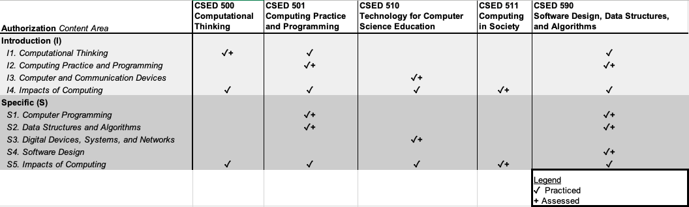

# Overview

[Introductory Computer Science](http://www.ctc.ca.gov/credentials/manuals-handbooks/Supplement-Auth.pdf) concept areas: 

* **I1. Computational thinking**: involves solving problems and designing systems, using fundamental computing concepts such as decomposition, data representation, generalization/abstraction, and algorithms.
* **I2. Computing practice and programming**: includes expertise in at least one block--- based, visual (drag-and-drop) programming language (e.g., Alice, Blockly, Kodu, Logo, Scratch, Snap!) or a modern, high-level programming language.
* **I3. Computer and communications devices**: covers the major components and functions of digital devices and the computing systems they compose.
* **I4. Impacts of computing**: includes the social, ethical, and legal issues and impacts of computing, as well as the contributions of computer science to current and future innovations in the arts, business, humanities, medicine, and science. These topics may be included within courses that cover any of the other content areas.
* *Degrees in Educational Technology or Information Technology do not automatically meet the requirement without submission of official transcripts to verify all the required content areas have been fulfilled.*

[Specific Computer Science](http://www.ctc.ca.gov/credentials/manuals-handbooks/Supplement-Auth.pdf) concept areas:

* **S1. Computer Programming**: includes expertise in at least one modern, high-level programming language (e.g., Python, Java, C/C++/C#).
* **S2. Data structures and algorithms**: covers data representation, abstraction, searching and sorting in the context of solving problems using programming and computational tools.
* **S3. Digital devices, systems and networks**: covers computer and communication devices and
the systems they compose, including the concepts and abstractions that enable stand-alone,
networked, and mobile digital devices to operate and communicate.
* **S4. Software design**: covers the process of planning, engineering and implementing a software system to solve a problem, typically using both a design and a programming methodology, such as object-oriented and functional approaches.
* **S5. Impacts of computing**: includes the social, ethical, and legal issues and impacts of computing, as well as the contributions of computer science to current and future
innovations in the arts, business, humanities, medicine, and science. These topics may be
included within courses that cover any of the other content areas.
* *The balance of the units may be in any course that falls within the academic department for that subject category. Computer classes in the Education Department may be used including a pedagogy course in computer science from either department.*
* *Degrees in Educational Technology or Information Technology do not automatically meet the requirement without submission of official transcripts to verify all the required content areas have been fulfilled.*

# Curriculum

## CSED 500 Computational Thinking (SM 3.0)
This course explores broad concepts and applications of Computer Science including Human-Computer Interaction, problem solving, web design, programming, computing and data analysis, and robotics. The course introduces programming in a graphical, block-based development environment. Synchronous online discussion and laboratory; laptop or desktop computer is required.

*This course aligns with the [Exploring Computer Science](http://www.exploringcs.org/curriculum) curriculum that targets K-9 Computer Science education, with both "unplugged" and online instructional activities.*

## CSED 501 Computing Practice and Programming (SM 3.0)
In a broad introduction to Computer Science, this course emphasizes problem solving by collaboratively designing, developing, and evaluating algorithms. The class explores creative development, abstraction, data representation, computer systems and networks, and impacts of computing while learning the fundamentals of high-level programming in Python. Synchronous online discussion and laboratory; laptop or desktop computer is required.

*This course aligns with the [AP Computer Science Principles](https://apcentral.collegeboard.org/courses/ap-computer-science-principles/course#:~:text=AP%20Computer%20Science%20Principles%20is,development%20of%20algorithms%20and%20programs.) curriculum and supplements it with discussion of pedagogy and instructional techniques*

## CSED 510 Technology for Computer Science Education (FA 2.0)
Hardware and software technologies evolve rapidly. This course provides an overview of components and integrated systems of computers and networking. Students complete a supervised project to plan and integrate educational technologies for Computer Science classrooms. The project explores technology for supporting evidence-based pedagogy to foster interactive, creative, and inclusive Computer Science education. Asynchronous online lecture and supervised project.

Prerequisites: CSED 500, CSED 501, or CSCI 111

## CSED 511 Computing in Society (SP 2.0)
Computers are ubiquitous and influential in shaping 21st century societies. This course discusses the impacts of computers on individuals and on society. It also addresses issues of inclusion and equity in Computer Science pedagogy and relates contemporary social issues to the discipline. Students complete a supervised project to develop educational materials for Computer Science classrooms that contextualize computing in society. Asynchronous online lecture and supervised project.

Prerequisites: CSED 500, CSED 501, or CSCI 111

## CSED 590 Software Design, Data Structures, and Algorithms (SM 4.0)
This course explores the design and construction of software applications by adopting the Agile software development process. Students practice the fundamentals Object-Oriented Programming with the Java programming language. Concepts include primitive types and operations, objects and classes, boolean expressions, decisions, iteration, single- and multi-dimensional arrays, inheritance, recursion, sorting, and searching. Projects involve software engineering practices and tools, including professional integrated development environments (IDE), to create real software applications. Synchronous online discussion and laboratory; Laptop or desktop is required.

Prerequisites: CSED 501 or CSCI 111

*This course aligns with the [AP Computer Science A](https://apcentral.collegeboard.org/courses/ap-computer-science-a?course=ap-computer-science-a) curriculum and supplements it with software design skills.*

# Requirements

## Introductory Supplemental Authorization

The **Introductory Computer Science** authorization "may be added to the Single Subject, Standard Secondary, and Special Secondary (in academic subject areas only) Teaching Credentials and authorize the holder to teach the supplementary subject matter content typically included in curriculum guidelines and textbooks for study in grades 9 and below." ([Handbook, pg 4](http://www.ctc.ca.gov/credentials/manuals-handbooks/Supplement-Auth.pdf))

### Required Courses

* **CSED 500 Computational Thinking (SM 3.0)**
* **CSED 501 Computing Practice and Programming (SM 3.0)** or *CSCI 111 Programming & Algorithms I (FS 4.0)^+^*
* **CSED 510 Technology for Computer Science Education (FA 2.0)** or *CINS 242 Information Systems Design (FA 3.0)^+^*
* **CSED 511 Computing in Society (SP 2.0)** or *CSCI 301W Computer's Impact on Society (FS 3.0)^+^*

**Total Units: 10-14**

## Specific Supplemental Authorization

The **Specfic Computer Science** authorization "may be added to Single Subject, Standard Secondary and Special Secondary (academic subject areas only) Teaching Credentials and authorize the holder to teach the specific subject in grades preschool, kindergarten-12, and classes organized primarily for adults." ([Handbook, pg 9](http://www.ctc.ca.gov/credentials/manuals-handbooks/Supplement-Auth.pdf))

### Required Courses

* **CSED 501 Computing Practice and Programming (SM 3.0)** or *CSCI 111 Programming & Algorithms I (FS 4.0)^+^*
* **CSED 510 Technology for Computer Science Education (FA 2.0)** or *CINS 242 Information Systems Design (FA 3.0)^+^*
* **CSED 511 Computing in Society (SP 2.0)** or *CSCI 301W Computer's Impact on Society (FS 3.0)^+^*
* **CSED 590 Software Design, Data Structures, and Algorithms (SM 4.0)** or *CSCI 211 Programming & Algorithms II (FS 4.0), CSCI 311 Algorithms & Data Structures (FS 4.0), and CSCI 430 Software Engineering (FS 3.0)^+^*

*^+^ Courses outside of CSED subject area have additional prerequisites*

**Total Units: 11-25**

## Requirement Fulfillment Matrix

